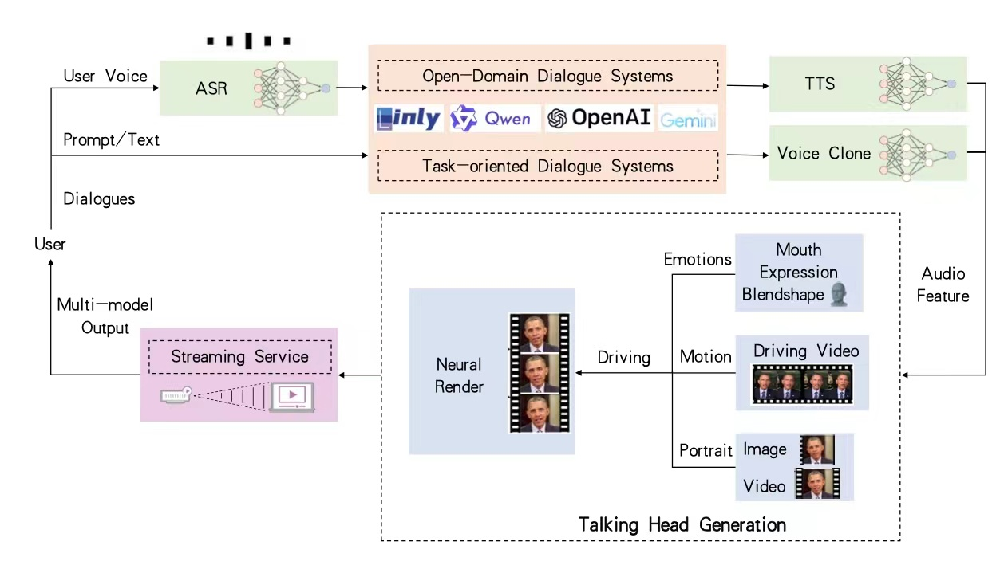
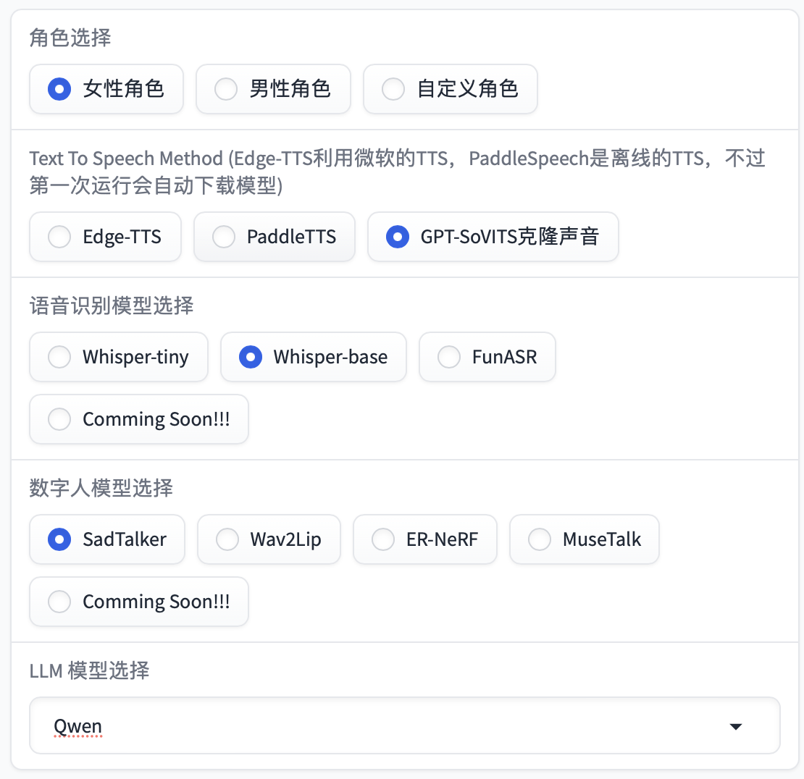
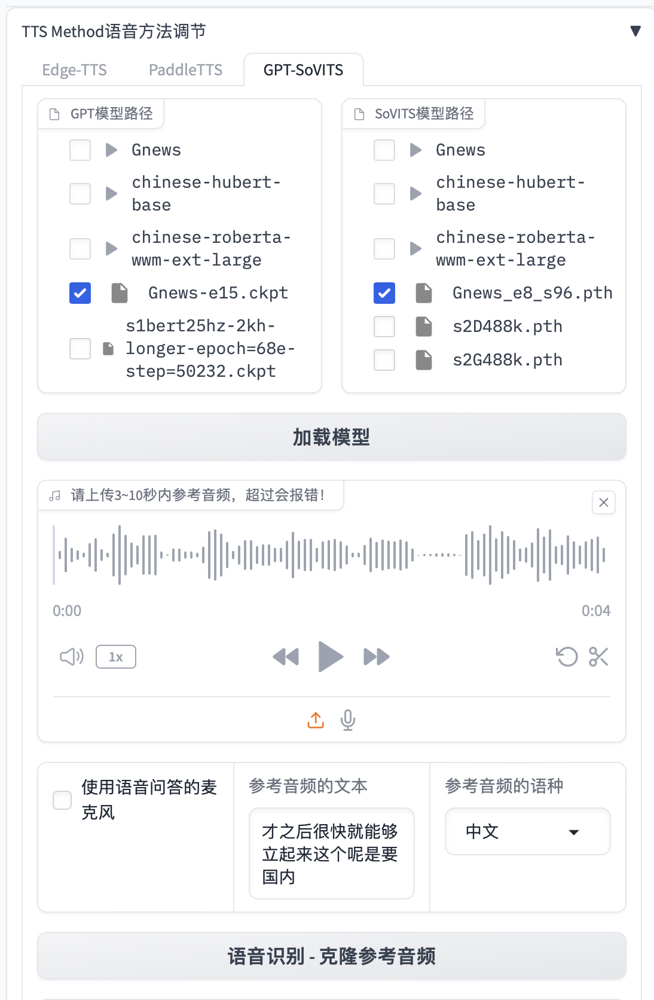
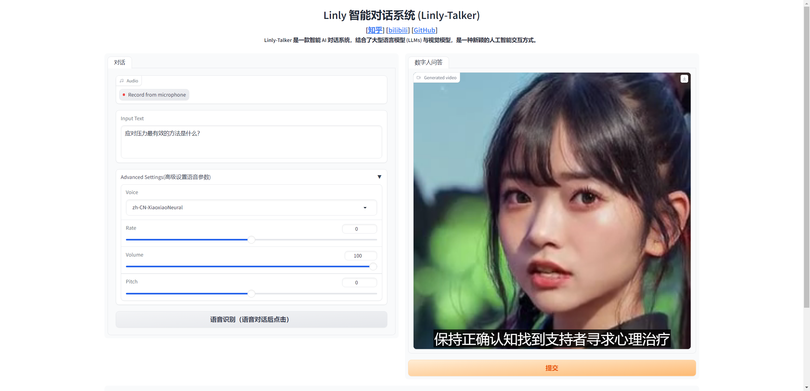
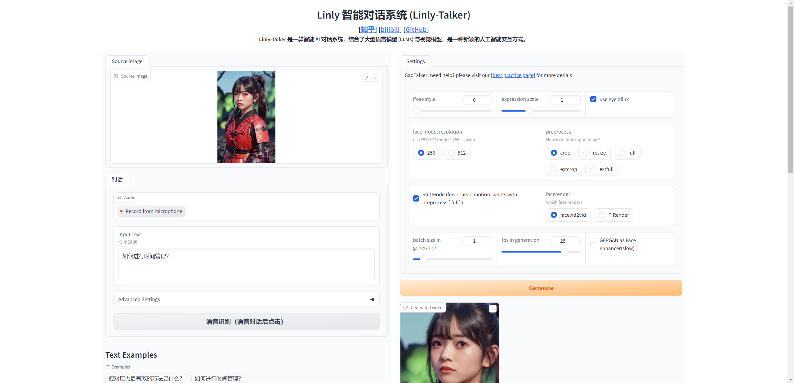
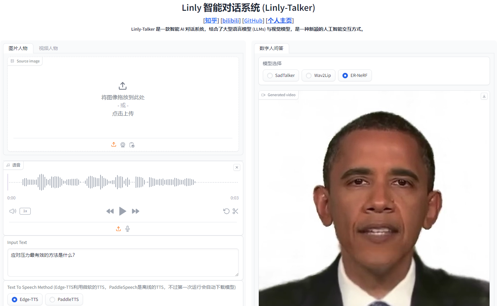
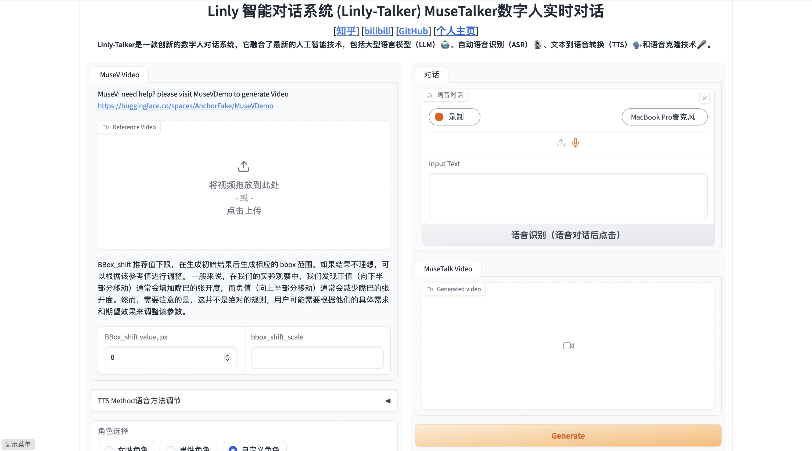

# Digital Human Intelligent Dialogue System - Linly-Talker — 'Interactive Dialogue with Your Virtual Self'

<div align="center">
<h1>Linly-Talker WebUI</h1>

[](https://github.com/Kedreamix/Linly-Talker)

<br>

[](https://colab.research.google.com/github/Kedreamix/Linly-Talker/blob/main/colab_webui.ipynb)
[](https://github.com/Kedreamix/Linly-Talker/blob/main/LICENSE)
[](https://huggingface.co/Kedreamix/Linly-Talker)

[**English**](./README.md) | [**中文简体**](./README_zh.md)

</div>

**2023.12 Update** 📆

**Users can upload any images for the conversation**

**2024.01 Update** 📆📆

- **Exciting news! I've now incorporated both the powerful GeminiPro and Qwen large models into our conversational scene. Users can now upload images during the conversation, adding a whole new dimension to the interactions.** 
- **The deployment invocation method for FastAPI has been updated.**
- **The advanced settings options for Microsoft TTS have been updated, increasing the variety of voice types. Additionally, video subtitles have been introduced to enhance visualization.**
- **Updated the GPT multi-turn conversation system to establish contextual connections in dialogue, enhancing the interactivity and realism of the digital persona.**

**2024.02 Update** 📆

- **Updated Gradio to the latest version 4.16.0, providing the interface with additional functionalities such as capturing images from the camera to create digital personas, among others.**
- **ASR and THG have been updated. FunASR from Alibaba has been integrated into ASR, enhancing its speed significantly. Additionally, the THG section now incorporates the Wav2Lip model, while ER-NeRF is currently in preparation (Coming Soon).**
- **I have incorporated the GPT-SoVITS model, which is a voice cloning method. By fine-tuning it with just one minute of a person's speech data, it can effectively clone their voice. The results are quite impressive and worth recommending.**
- **I have integrated a web user interface (WebUI) that allows for better execution of Linly-Talker.**

**2024.04 Update** 📆

- **Updated the offline mode for Paddle TTS, excluding Edge TTS.**
- **Updated ER-NeRF as one of the choices for Avatar generation.**
- **Updated app_talk.py to allow for the free upload of voice and images/videos for generation without being based on a dialogue scenario.**

**2024.05 Update** 📆

- **Updated the beginner-friendly AutoDL deployment tutorial, and also updated the codewithgpu image, allowing for one-click experience and learning.**
- **Updated WebUI.py: Linly-Talker WebUI now supports multiple modules, multiple models, and multiple options**

**2024.06 Update** 📆

- **Integrated MuseTalk into Linly-Talker and updated the WebUI, enabling basic real-time conversation capabilities.**
- **The refined WebUI defaults to not loading the LLM model to reduce GPU memory usage. It directly responds with text to complete voiceovers. The enhanced WebUI features three main functions: personalized character generation, multi-turn intelligent dialogue with digital humans, and real-time MuseTalk conversations. These improvements reduce previous GPU memory redundancies and add more prompts to assist users effectively.**

**2024.08 Update** 📆

- **Updated CosyVoice to offer high-quality text-to-speech (TTS) functionality and voice cloning capabilities; also upgraded to Wav2Lipv2 to enhance overall performance.**

**2024.09 Update** 📆

- **Added Linly-Talker API documentation, providing detailed interface descriptions to help users access Linly-Talker’s features via the API.**

**2024.12 Update** 📆

- **Implemented a simple fix for the Edge-TTS bug, resolved several issues with MuseTalk, and plan to integrate fishTTS for more stable TTS performance, along with incorporating advanced digital human technologies.**

**2025.02 Update** 📆

- **Added OmniSenseVoice Model for Faster Speech Recognition**
---

<details>
<summary>Content</summary>

<!-- TOC -->

- [Digital Human Intelligent Dialogue System - Linly-Talker — 'Interactive Dialogue with Your Virtual Self'](#digital-human-intelligent-dialogue-system---linly-talker--interactive-dialogue-with-your-virtual-self)
  - [Introduction](#introduction)
  - [TO DO LIST](#to-do-list)
  - [Example](#example)
  - [Setup Environment](#setup-environment)
  - [API Documentation](#api-documentation)
  - [ASR - Speech Recognition](#asr---speech-recognition)
    - [Whisper](#whisper)
    - [FunASR](#funasr)
    - [Coming Soon](#coming-soon)
  - [TTS - Text To Speech](#tts---text-to-speech)
    - [Edge TTS](#edge-tts)
    - [PaddleTTS](#paddletts)
    - [Coming Soon](#coming-soon-1)
  - [Voice Clone](#voice-clone)
    - [GPT-SoVITS（Recommend）](#gpt-sovitsrecommend)
    - [XTTS](#xtts)
    - [CosyVoice](#cosyvoice)
    - [Coming Soon](#coming-soon-2)
  - [THG - Avatar](#thg---avatar)
    - [SadTalker](#sadtalker)
    - [Wav2Lip](#wav2lip)
    - [Wav2Lipv2](#wav2lipv2)
    - [ER-NeRF](#er-nerf)
    - [MuseTalk](#musetalk)
    - [Coming Soon](#coming-soon-3)
  - [LLM - Conversation](#llm---conversation)
    - [Linly-AI](#linly-ai)
    - [Qwen](#qwen)
    - [Gemini-Pro](#gemini-pro)
    - [ChatGPT](#chatgpt)
    - [ChatGLM](#chatglm)
    - [GPT4Free](#gpt4free)
    - [LLM Multiple Model Selection](#llm-multiple-model-selection)
    - [Coming Soon](#coming-soon-4)
  - [Optimizations](#optimizations)
  - [Gradio](#gradio)
  - [Start WebUI](#start-webui)
    - [WebUI](#webui)
    - [Old Verison](#old-verison)
  - [Folder structure](#folder-structure)
  - [Reference](#reference)
  - [License](#license)
  - [Star History](#star-history)

<!-- /TOC -->

</details>


## Introduction

Linly-Talker is an innovative digital human conversation system that integrates the latest artificial intelligence technologies, including Large Language Models (LLM) 🤖, Automatic Speech Recognition (ASR) 🎙️, Text-to-Speech (TTS) 🗣️, and voice cloning technology 🎤. This system offers an interactive web interface through the Gradio platform 🌐, allowing users to upload images 📷 and engage in personalized dialogues with AI 💬.

The core features of the system include:

1. **Multi-Model Integration**: Linly-Talker combines major models such as Linly, GeminiPro, Qwen, as well as visual models like Whisper, SadTalker, to achieve high-quality dialogues and visual generation.
2. **Multi-Turn Conversational Ability**: Through the multi-turn dialogue system powered by GPT models, Linly-Talker can understand and maintain contextually relevant and coherent conversations, significantly enhancing the authenticity of the interaction.
3. **Voice Cloning**: Utilizing technologies like GPT-SoVITS, users can upload a one-minute voice sample for fine-tuning, and the system will clone the user's voice, enabling the digital human to converse in the user's voice.
4. **Real-Time Interaction**: The system supports real-time speech recognition and video captioning, allowing users to communicate naturally with the digital human via voice.
5. **Visual Enhancement**: With digital human generation technologies, Linly-Talker can create realistic digital human avatars, providing a more immersive experience.

The design philosophy of Linly-Talker is to create a new form of human-computer interaction that goes beyond simple Q&A. By integrating advanced technologies, it offers an intelligent digital human capable of understanding, responding to, and simulating human communication.



> [!NOTE]
>
> You can watch the demo video [here](https://www.bilibili.com/video/BV1rN4y1a76x/).
>
> I have recorded a series of videos on Bilibili, which also represent every step of my updates and methods of use. For detailed information, please refer to [Digital Human Dialogue System - Linly-Talker Collection](https://space.bilibili.com/241286257/channel/collectiondetail?sid=2065753).
>
> - [🔥🔥🔥 Digital Human Dialogue System Linly-Talker 🔥🔥🔥](https://www.bilibili.com/video/BV1rN4y1a76x/)
> - [🚀 The Future of Digital Humans: The Empowerment Path of Linly-Talker + GPT-SoVIT Voice Cloning Technology](https://www.bilibili.com/video/BV1S4421A7gh/)
> - [Deploying Linly-Talker on AutoDL Platform (Super Detailed Tutorial for Beginners)](https://www.bilibili.com/video/BV1uT421m74z/)
> - [Linly-Talker Update: Offline TTS Integration and Customized Digital Human Solutions](https://www.bilibili.com/video/BV1Mr421u7NN/)

## TO DO LIST

- [x] Completed the basic conversation system flow, capable of `voice interactions`.
- [x] Integrated the LLM large model, including the usage of `Linly`, `Qwen`, and `GeminiPro`.
- [x] Enabled the ability to upload `any digital person's photo` for conversation.
- [x] Integrated `FastAPI` invocation for Linly.
- [x] Utilized Microsoft `TTS` with advanced options, allowing customization of voice and tone parameters to enhance audio diversity.
- [x] `Added subtitles` to video generation for improved visualization.
- [x] GPT `Multi-turn Dialogue System` (Enhance the interactivity and realism of digital entities, bolstering their intelligence)
- [x] Optimized the Gradio interface by incorporating additional models such as Wav2Lip, FunASR, and others.
- [x] `Voice Cloning` Technology (Synthesize one's own voice using voice cloning to enhance the realism and interactive experience of digital entities)
- [x] Integrate offline TTS (Text-to-Speech) along with NeRF-based methods and models.
- [x] Linly-Talker WebUI supports multiple modules, multiple models, and multiple options
- [x] Added MuseTalk functionality to Linly-Talker, achieving near real-time speed with very fast communication.
- [x] Integrated MuseTalk into the Linly-Talker WebUI.
- [x] Added CosyVoice, which provides high-quality text-to-speech (TTS) functionality and voice cloning capabilities. Additionally, updated to Wav2Lipv2 to enhance image quality effects.
- [x] Added Linly-Talker API documentation with detailed interface descriptions.
- [ ] `Real-time` Speech Recognition (Enable conversation and communication between humans and digital entities using voice)

> [!IMPORTANT]
>
> 🔆 The Linly-Talker project is ongoing - pull requests are welcome! If you have any suggestions regarding new model approaches, research, techniques, or if you discover any runtime errors, please feel free to edit and submit a pull request. You can also open an issue or contact me directly via email. 📩⭐ If you find this repository useful, please give it a star! 🤩

> [!TIP]
>
> If you encounter any issues during deployment, please consult the [Common Issues Summary](https://github.com/Kedreamix/Linly-Talker/blob/main/常见问题汇总.md) section, where I have compiled a list of all potential problems. Additionally, a discussion group is available here, and I will provide regular updates. Thank you for your attention and use of Linly-Talker!

## Example

|                        文字/语音对话                         |                          数字人回答                          |
| :----------------------------------------------------------: | :----------------------------------------------------------: |
|                 应对压力最有效的方法是什么？                 | <video src="https://github.com/Kedreamix/Linly-Talker/assets/61195303/f1deb189-b682-4175-9dea-7eeb0fb392ca"></video> |
|                      如何进行时间管理？                      | <video src="https://github.com/Kedreamix/Linly-Talker/assets/61195303/968b5c43-4dce-484b-b6c6-0fd4d621ac03"></video> |
|  撰写一篇交响乐音乐会评论，讨论乐团的表演和观众的整体体验。  | <video src="https://github.com/Kedreamix/Linly-Talker/assets/61195303/f052820f-6511-4cf0-a383-daf8402630db"></video> |
| 翻译成中文：Luck is a dividend of sweat. The more you sweat, the luckier you get. | <video src="https://github.com/Kedreamix/Linly-Talker/assets/61195303/118eec13-a9f7-4c38-b4ad-044d36ba9776"></video> |

## Setup Environment

> [!NOTE]
>
> AutoDL has released an image, which can be used directly at [https://www.codewithgpu.com/i/Kedreamix/Linly-Talker/Kedreamix-Linly-Talker](https://www.codewithgpu.com/i/Kedreamix/Linly-Talker/Kedreamix-Linly-Talker). You can also create an environment directly using Docker. I will continue to update the image.
>
> ```bash
> docker pull registry.cn-beijing.aliyuncs.com/codewithgpu2/kedreamix-linly-talker:afGA8RPDLf
> ```
>
> For Windows, I've included an all-in-one Python package. You can run the steps in sequence to install the necessary dependencies and download the corresponding model to get it running. Follow the instructions using `conda` and start installing PyTorch from step 02. If you encounter any issues, please feel free to contact me.
>
> [Windows All-in-One Package](https://pan.quark.cn/s/cc8f19c45a15)

Download the code:

```bash
git clone https://github.com/Kedreamix/Linly-Talker.git --depth 1

cd Linly-Talker
git submodule update --init --recursive
```

---

If you are using Linly-Talker, you can set up the environment directly with Anaconda, which covers almost all the dependencies required by the models. The specific steps are as follows:

```bash
conda create -n linly python=3.10
conda activate linly

# PyTorch Installation Option 1: Using conda  
# CUDA 11.8  
# conda install pytorch==2.4.1 torchvision==0.19.1 torchaudio==2.4.1 pytorch-cuda=11.8 -c pytorch -c nvidia  
# CUDA 12.1  
# conda install pytorch==2.4.1 torchvision==0.19.1 torchaudio==2.4.1 pytorch-cuda=12.1 -c pytorch -c nvidia  
# CUDA 12.4  
# conda install pytorch==2.4.1 torchvision==0.19.1 torchaudio==2.4.1 pytorch-cuda=12.4 -c pytorch -c nvidia  

# PyTorch Installation Option 2: Using pip  
# CUDA 11.8  
# pip install torch==2.4.1 torchvision==0.19.1 torchaudio==2.4.1 --index-url https://download.pytorch.org/whl/cu118  
# CUDA 12.1  
# pip install torch==2.4.1 torchvision==0.19.1 torchaudio==2.4.1 --index-url https://download.pytorch.org/whl/cu121  
# CUDA 12.4  
# pip install torch==2.4.1 torchvision==0.19.1 torchaudio==2.4.1 --index-url https://download.pytorch.org/whl/cu124  
pip install torch==2.0.1 torchvision==0.15.2 torchaudio==2.0.2 --index-url https://download.pytorch.org/whl/cu118

conda install -q ffmpeg==4.2.2 # ffmpeg==4.2.2

# Upgrade pip
python -m pip install --upgrade pip
# Change the PyPI source to speed up the installation of packages
pip config set global.index-url https://pypi.tuna.tsinghua.edu.cn/simple

pip install tb-nightly -i https://mirrors.aliyun.com/pypi/simple
pip install -r requirements_webui.txt

# Install dependencies related to musetalk
pip install --no-cache-dir -U openmim
mim install mmengine 
mim install "mmcv==2.1.0" 
mim install "mmdet>=3.1.0" 
mim install "mmpose>=1.1.0" 

# 💡The ttsfrd from CosyVoice can be replaced with WeTextProcessing, so a few steps can be omitted, while ensuring compatibility with other Python versions

# ⚠️ Note: You must first download CosyVoice-ttsfrd. Complete the model download before proceeding with these steps.
# mkdir -p CosyVoice/pretrained_models # Create directory CosyVoice/pretrained_models
# mv checkpoints/CosyVoice_ckpt/CosyVoice-ttsfrd CosyVoice/pretrained_models # Move directory
# unzip CosyVoice/pretrained_models/CosyVoice-ttsfrd/resource.zip # Unzip
# This .whl library is only compatible with Python 3.8
# pip install CosyVoice/pretrained_models/CosyVoice-ttsfrd/ttsfrd-0.3.6-cp38-cp38-linux_x86_64.whl

# Install NeRF-based dependencies, which might have several issues and can be skipped initially
pip install "git+https://github.com/facebookresearch/pytorch3d.git"
# If you encounter problems installing PyTorch3D, you can use the following command to install it:
# python scripts/install_pytorch3d.py
pip install -r TFG/requirements_nerf.txt

# If you encouter issues with pyaudio
sudo apt-get update
sudo apt-get install libasound-dev portaudio19-dev libportaudio2 libportaudiocpp0

# Note the following modules. If installation fails, you can enter the directory and use pip install . or python setup.py install to compile and install:
# NeRF/freqencoder
# NeRF/gridencoder
# NeRF/raymarching
# NeRF/shencoder

# If you encounter sox compatibility issues
# ubuntu
sudo apt-get install sox libsox-dev
# centos
sudo yum install sox sox-devel
```

> [!NOTE]
>
> The installation process is very slow.

Below are some older installation methods, which might cause dependency conflicts, but they generally don't produce many bugs. For an easier and better installation, I've updated the above version. You can ignore the following versions or refer to them if you encounter issues.

> To install the environment using Anaconda and PyTorch, follow the steps below:
>
> ```bash
> conda create -n linly python=3.10
> conda activate linly
> 
> # PyTorch Installation Method 1: Conda Installation (Recommended)
> conda install pytorch==1.12.1 torchvision==0.13.1 torchaudio==0.12.1 cudatoolkit=11.3 -c pytorch
> 
> # PyTorch Installation Method 2: Pip Installation
> pip install torch==1.12.1+cu113 torchvision==0.13.1+cu113 torchaudio==0.12.1 --extra-index-url https://download.pytorch.org/whl/cu113
> 
> conda install -q ffmpeg # ffmpeg==4.2.2
> 
> pip install -r requirements_app.txt
> ```
>
> If you want to use models like voice cloning, you may need a higher version of PyTorch. However, the functionality will be more diverse. You may need to use CUDA 11.8 as the driver version, which you can choose.
>
> ```bash
> conda create -n linly python=3.10  
> conda activate linly
> 
> pip install torch==2.0.1 torchvision==0.15.2 torchaudio==2.0.2 --index-url https://download.pytorch.org/whl/cu118
> 
> conda install -q ffmpeg # ffmpeg==4.2.2
> 
> pip install -r requirements_app.txt
> 
> # Install dependencies for voice cloning
> pip install -r VITS/requirements_gptsovits.txt
> ```
>
> If you wish to use NeRF-based models, you may need to set up the corresponding environment:
>
> ```bash
> # Install dependencies for NeRF
> pip install "git+https://github.com/facebookresearch/pytorch3d.git"
> pip install -r TFG/requirements_nerf.txt
> 
> # If there are issues with PyAudio, you can install the corresponding dependencies
> # sudo apt-get install libasound-dev portaudio19-dev libportaudio2 libportaudiocpp0
> 
> # Note the following modules. If installation is unsuccessful, you can navigate to the path and use pip install . or python setup.py install to compile and install.
> # NeRF/freqencoder
> # NeRF/gridencoder
> # NeRF/raymarching
> # NeRF/shencoder
> ```
>
> If you are using PaddleTTS, you can set up the corresponding environment with:
>
> ```bash
> pip install -r TTS/requirements_paddle.txt
> ```
>
> If you are using the FunASR speech recognition model, you can install the environment with:
>
> ```
> pip install -r ASR/requirements_funasr.txt
> ```
>
> If using the MuesTalk model, you can set up the environment with the following commands:
>
> ```bash
> pip install --no-cache-dir -U openmim 
> mim install mmengine 
> mim install "mmcv>=2.0.1" 
> mim install "mmdet>=3.1.0" 
> mim install "mmpose>=1.1.0" 
> pip install -r TFG/requirements_musetalk.txt 
> ```
>

> [!NOTE]
>
> Next, you need to install the corresponding models. You can download them using the following methods. Once downloaded, place the files in the specified folder structure (explained at the end of this document).
>
> We recommend downloading from modelscope for the latest updates.
>
> - [Baidu (百度云盘)](https://pan.baidu.com/s/1eF13O-8wyw4B3MtesctQyg?pwd=linl) (Password: `linl`)
> - [huggingface](https://huggingface.co/Kedreamix/Linly-Talker)
> - [modelscope](https://www.modelscope.cn/models/Kedreamix/Linly-Talker/summary)
> - [Quark(夸克网盘)](https://pan.quark.cn/s/f48f5e35796b)
>

I made a script that can download all the models mentioned below without requiring much input from the user. This method is suitable for stable network conditions, especially for Linux users. For Windows users, Git can also be used to download the models. If the network connection is unstable, users can choose to manually download the models or try running a Shell script to complete the download. The script has the following features:

1. **Choose Download Method**: Users can choose to download models from three different sources: ModelScope, Huggingface, or Huggingface mirror site.
2. **Download Models**: Based on the user's selection, the script executes the corresponding download command.
3. **Move Model Files**: After downloading, the script moves the model files to the specified directory.
4. **Error Handling**: Error checks are included in each step of the operation. If any step fails, the script will output an error message and stop execution.

```bash
sh scripts/download_models.sh
```

**HuggingFace Download**

If the download speed is too slow, consider using a mirror site. For more information, refer to [Efficiently Obtain Hugging Face Models Using Mirror Sites](https://kedreamix.github.io/2024/01/05/Note/HuggingFace/?highlight=镜像).

```bash
# Download pre-trained models from HuggingFace
git lfs install
git clone https://huggingface.co/Kedreamix/Linly-Talker --depth 1
# git lfs clone https://huggingface.co/Kedreamix/Linly-Talker --depth 1

# pip install -U huggingface_hub
# export HF_ENDPOINT=https://hf-mirror.com # Use a mirror site
huggingface-cli download --resume-download --local-dir-use-symlinks False Kedreamix/Linly-Talker --local-dir Linly-Talker
```

**ModelScope Download**

```bash
# Download pre-trained models from Modelscope
# 1. Using git
git lfs install
git clone https://www.modelscope.cn/Kedreamix/Linly-Talker.git --depth 1
# git lfs clone https://www.modelscope.cn/Kedreamix/Linly-Talker.git

# 2. Download using Python code
pip install modelscope
from modelscope import snapshot_download
model_dir = snapshot_download('Kedreamix/Linly-Talker')
```

**Move All Models to the Current Directory**

If you downloaded from Baidu Netdisk, you can refer to the directory structure at the end of the document to move the models.

```bash
# Move all models to the current directory
# Checkpoints contain SadTalker and Wav2Lip
mv Linly-Talker/checkpoints/* ./checkpoints

# Enhanced GFPGAN for SadTalker
# pip install gfpgan
# mv Linly-Talker/gfpan ./

# Voice cloning models
mv Linly-Talker/GPT_SoVITS/pretrained_models/* ./GPT_SoVITS/pretrained_models/

# Qwen large language model
mv Linly-Talker/Qwen ./

# MuseTalk model
mkdir -p ./Musetalk/models
mv Linly-Talker/MuseTalk/* ./Musetalk/models
```

For the convenience of deployment and usage, an `configs.py` file has been updated. You can modify some hyperparameters in this file for customization:

```bash
# Device Running Port
port = 7870

# API Running Port and IP
# Localhost port is 127.0.0.1; for global port forwarding, use "0.0.0.0"
ip = '127.0.0.1'
api_port = 7871

# Linly Model Path
mode = 'api'  # For 'api', Linly-api-fast.py must be run first
mode = 'offline'
model_path = 'Linly-AI/Chinese-LLaMA-2-7B-hf'

# SSL Certificate (required for microphone interaction)
# Preferably an absolute path
ssl_certfile = "./https_cert/cert.pem"
ssl_keyfile = "./https_cert/key.pem"
```

This file allows you to adjust parameters such as the device running port, API running port, Linly model path, and SSL certificate paths for ease of deployment and configuration.


## API Documentation

In the [api/README.md](api/README.md) file, we provide detailed information about the usage and configuration of the Linly-Talker API. This documentation includes information on how to call the API, the required parameters, and the format of the returned data. By reviewing these documents, users can gain a comprehensive understanding of how to utilize the API to implement various Linly-Talker functionalities, including starting conversations, uploading images, performing speech recognition, and generating speech.

For detailed API interface descriptions, please refer to the `api/README.md` file.


## ASR - Speech Recognition

For detailed information about the usage and code implementation of Automatic Speech Recognition (ASR), please refer to [ASR - Bridging the Gap with Digital Humans](./ASR/README.md).

### Whisper

To implement ASR (Automatic Speech Recognition) using OpenAI's Whisper, you can refer to the specific usage methods provided in the GitHub repository: [https://github.com/openai/whisper](https://github.com/openai/whisper)


### FunASR

The speech recognition performance of Alibaba's FunASR is quite impressive and it is actually better than Whisper in terms of Chinese language. Additionally, FunASR is capable of achieving real-time results, making it a great choice. You can experience FunASR by accessing the FunASR file in the ASR folder. Please refer to [https://github.com/alibaba-damo-academy/FunASR](https://github.com/alibaba-damo-academy/FunASR) for more information.


### Coming Soon

Welcome everyone to provide suggestions, motivating me to continuously update the models and enrich the functionality of Linly-Talker.

## TTS - Text To Speech

For detailed information about the usage and code implementation of Text-to-Speech (TTS), please refer to [TTS - Empowering Digital Humans with Natural Speech Interaction](./TTS/README.md).

### Edge TTS

To use Microsoft Edge's online text-to-speech service from Python without needing Microsoft Edge or Windows or an API key, you can refer to the GitHub repository at [https://github.com/rany2/edge-tts](https://github.com/rany2/edge-tts). It provides a Python module called "edge-tts" that allows you to utilize the service. You can find detailed installation instructions and usage examples in the repository's README file.

> [!Warning]
>
> Due to some issues with the Edge TTS repository, it seems that Microsoft has restricted certain IPs. For more details, refer to [403 error is back/need to implement Sec-MS-GEC token](https://github.com/rany2/edge-tts/issues/290) and [Add support for clock adjustment for Sec-MS-GEC token](https://github.com/rany2/edge-tts/pull/309). The solution is still unstable for now. I have made some modifications, but if it continues to be unstable, please consider using alternative methods. I recommend using the CosyVoice method.


### PaddleTTS

In practical use, there may be scenarios that require offline operation. Since Edge TTS requires an online environment to generate speech, we have chosen PaddleSpeech, another open-source alternative, for Text-to-Speech (TTS). Although there might be some differences in the quality, PaddleSpeech supports offline operations. For more information, you can refer to the GitHub page of PaddleSpeech: [https://github.com/PaddlePaddle/PaddleSpeech](https://github.com/PaddlePaddle/PaddleSpeech).

### Coming Soon

Welcome everyone to provide suggestions, motivating me to continuously update the models and enrich the functionality of Linly-Talker.

## Voice Clone

For detailed information about the usage and code implementation of Voice Clone, please refer to [Voice Clone - Stealing Your Voice Quietly During Conversations](./VITS/README.md).

### GPT-SoVITS（Recommend）

Thank you for your open source contribution. I have also found the `GPT-SoVITS` voice cloning model to be quite impressive. You can find the project at [https://github.com/RVC-Boss/GPT-SoVITS](https://github.com/RVC-Boss/GPT-SoVITS).


### XTTS

Coqui XTTS is a leading deep learning toolkit for Text-to-Speech (TTS) tasks, allowing for voice cloning and voice transfer to different languages using a 5-second or longer audio clip.

🐸 TTS is a library for advanced text-to-speech generation.

🚀 Over 1100 pre-trained models for various languages.

🛠️ Tools for training new models and fine-tuning existing models in any language.

📚 Utility programs for dataset analysis and management.

- Experience XTTS online [https://huggingface.co/spaces/coqui/xtts](https://huggingface.co/spaces/coqui/xtts)
- Official GitHub repository: [https://github.com/coqui-ai/TTS](https://github.com/coqui-ai/TTS)


### CosyVoice

CosyVoice is an open-source multilingual speech understanding model developed by Alibaba’s Tongyi Lab, focusing on high-quality speech synthesis. The model has been trained on over 150,000 hours of data and supports speech synthesis in multiple languages, including Chinese, English, Japanese, Cantonese, and Korean. CosyVoice excels in multilingual speech generation, zero-shot voice generation, cross-lingual voice synthesis, and command execution capabilities.

CosyVoice supports one-shot voice cloning technology, enabling the generation of realistic and natural-sounding voices with details such as prosody and emotion using only 3 to 10 seconds of original audio.

GitHub project link: [CosyVoice GitHub](https://github.com/FunAudioLLM/CosyVoice)

CosyVoice includes several pre-trained speech synthesis models, mainly:

1. **CosyVoice-300M**: Supports zero-shot and cross-lingual speech synthesis in Chinese, English, Japanese, Cantonese, Korean, and other languages.
2. **CosyVoice-300M-SFT**: A model focused on supervised fine-tuning (SFT) inference.
3. **CosyVoice-300M-Instruct**: A model that supports command-based inference, capable of generating speech with specific tones, emotions, and other elements.

**Key Features**

1. **Multilingual Support**: Capable of handling various languages including Chinese, English, Japanese, Cantonese, and Korean.
2. **Multi-style Speech Synthesis**: Allows control over the tone and emotion of the generated speech through commands.
3. **Streaming Inference Support**: Future updates will include streaming inference modes, such as KV caching and SDPA, for real-time optimization.

Currently, Linly-Talker integrates three features from CosyVoice: pre-trained voice cloning, 3s rapid cloning, and cross-lingual cloning. Stay tuned for more exciting updates on Linly-Talker. Below are some examples of CosyVoice's capabilities:

<table>
<tr>
<th></th>
<th align="center">PROMPT TEXT</th>
<th align="center">PROMPT SPEECH</th>
<th align="center">TARGET TEXT</th>
<th align="center">RESULT</th>
</tr>
<tr>
<td align="center"><strong>Pre-trained Voice</strong></td>
<td align="center">中文女 音色（'中文女', '中文男', '日语男', '粤语女', '英文女', '英文男', '韩语女'）</td>
<td align="center">—</td>
<td align="center">你好，我是通义生成式语音大模型，请问有什么可以帮您的吗？</td>
<td align="center">


[sft.webm](https://github.com/user-attachments/assets/a9f9c8c4-7137-4845-9adb-a93ac304131e)

</td>
</tr>
<tr>
<td align="center"><strong>3s Language Cloning</strong></td>
<td align="center">希望你以后能够做的比我还好呦。</td>
<td align="center">

[zero_shot_prompt.webm](https://github.com/user-attachments/assets/1ef09db6-42e5-42d2-acc2-d44e70b147f9)
</td>
<td align="center">收到好友从远方寄来的生日礼物，那份意外的惊喜与深深的祝福让我心中充满了甜蜜的快乐，笑容如花儿般绽放。</td>
<td align="center">

[zero_shot.webm](https://github.com/user-attachments/assets/ba46c58f-2e16-4440-b920-51ec288f09e6)
</td>
</tr>
<tr>
<td align="center"><strong>Cross-lingual Cloning</strong></td>
<td align="center">在那之后，完全收购那家公司，因此保持管理层的一致性，利益与即将加入家族的资产保持一致。这就是我们有时不买下全部的原因。</td>
<td align="center">

[cross_lingual_prompt.webm](https://github.com/user-attachments/assets/378ae5e6-b52a-47b4-b0db-d84d1edd6e56)
</td>
<td align="center">
&lt; |en|&gt;And then later on, fully acquiring that company. So keeping management in line, interest in line with the asset that's coming into the family is a reason why sometimes we don't buy the whole thing.
</td>
<td align="center">

[cross_lingual.webm](https://github.com/user-attachments/assets/b0162fc8-5738-4642-9fdd-b388a4965546)
</td>
</tr>
</table>


### Coming Soon

Welcome everyone to provide suggestions, motivating me to continuously update the models and enrich the functionality of Linly-Talker.

## THG - Avatar

Detailed information about the usage and code implementation of digital human generation can be found in [THG - Building Intelligent Digital Humans](./TFG/README.md).

### SadTalker

Digital persona generation can utilize SadTalker (CVPR 2023). For detailed information, please visit [https://sadtalker.github.io](https://sadtalker.github.io).

Before usage, download the SadTalker model:

```bash
bash scripts/sadtalker_download_models.sh  
```

[Baidu (百度云盘)](https://pan.baidu.com/s/1eF13O-8wyw4B3MtesctQyg?pwd=linl) (Password: `linl`)

[Quark(夸克网盘)](https://pan.quark.cn/s/f48f5e35796b)

> If downloading from Baidu Cloud, remember to place it in the `checkpoints` folder. The model downloaded from Baidu Cloud is named `sadtalker` by default, but it should be renamed to `checkpoints`.

### Wav2Lip

Digital persona generation can also utilize Wav2Lip (ACM 2020). For detailed information, refer to [https://github.com/Rudrabha/Wav2Lip](https://github.com/Rudrabha/Wav2Lip).

Before usage, download the Wav2Lip model:

| Model                        | Description                                           | Link to the model                                            |
| ---------------------------- | ----------------------------------------------------- | ------------------------------------------------------------ |
| Wav2Lip                      | Highly accurate lip-sync                              | [Link](https://iiitaphyd-my.sharepoint.com/:u:/g/personal/radrabha_m_research_iiit_ac_in/Eb3LEzbfuKlJiR600lQWRxgBIY27JZg80f7V9jtMfbNDaQ?e=TBFBVW) |
| Wav2Lip + GAN                | Slightly inferior lip-sync, but better visual quality | [Link](https://iiitaphyd-my.sharepoint.com/:u:/g/personal/radrabha_m_research_iiit_ac_in/EdjI7bZlgApMqsVoEUUXpLsBxqXbn5z8VTmoxp55YNDcIA?e=n9ljGW) |
| Expert Discriminator         | Weights of the expert discriminator                   | [Link](https://iiitaphyd-my.sharepoint.com/:u:/g/personal/radrabha_m_research_iiit_ac_in/EQRvmiZg-HRAjvI6zqN9eTEBP74KefynCwPWVmF57l-AYA?e=ZRPHKP) |
| Visual Quality Discriminator | Weights of the visual disc trained in a GAN setup     | [Link](https://iiitaphyd-my.sharepoint.com/:u:/g/personal/radrabha_m_research_iiit_ac_in/EQVqH88dTm1HjlK11eNba5gBbn15WMS0B0EZbDBttqrqkg?e=ic0ljo) |

### Wav2Lipv2

Inspired by the repository [https://github.com/primepake/wav2lip_288x288](https://github.com/primepake/wav2lip_288x288), Wav2Lipv2 uses a newly trained 288 model to achieve higher quality results.

Additionally, by employing YOLO for facial detection, the overall effect is improved. You can compare and test the results in Linly-Talker. The model has been updated, and the comparison is as follows:

| Wav2Lip                                                      | Wav2Lipv2                                                    |
| ------------------------------------------------------------ | ------------------------------------------------------------ |
| <video src="https://github.com/user-attachments/assets/d61df5cf-e3b9-4057-81fc-d69dcff806d6"></video> | <video src="https://github.com/user-attachments/assets/7f6be271-2a4d-4d9c-98f8-db25816c28b3"></video> |

### ER-NeRF

ER-NeRF (ICCV 2023) is a digital human built using the latest NeRF technology. It allows for the customization of digital characters and can reconstruct them using just a five-minute video of a person. For more details, please refer to [https://github.com/Fictionarry/ER-NeRF](https://github.com/Fictionarry/ER-NeRF).

Updated: Taking inspiration from the likeness of Obama, for better results, consider cloning and customizing the voice of digital personas for improved effectiveness.


### MuseTalk

MuseTalk is a real-time, high-quality audio-driven lip synchronization model capable of running at over 30 frames per second on an NVIDIA Tesla V100 GPU. This model can be integrated with input videos generated by MuseV, forming a part of a comprehensive virtual human solution. For more details, please refer to [https://github.com/TMElyralab/MuseTalk](https://github.com/TMElyralab/MuseTalk).

MuseTalk is trained to operate within the latent space of ft-mse-vae and offers the following features:

- **Unseen Face Synchronization**: It can modify unseen faces based on input audio, with a face region size of 256 x 256.
- **Multi-language Support**: Supports audio inputs in various languages, including Chinese, English, and Japanese.
- **High-performance Real-time Inference**: Achieves real-time inference at over 30 frames per second on an NVIDIA Tesla V100.
- **Facial Center Point Adjustment**: Allows the adjustment of the facial region's center point, significantly impacting the generated results.
- **HDTF Dataset Training**: Provides model checkpoints trained on the HDTF dataset.
- **Upcoming Training Code Release**: Training code will be released soon, facilitating further development and research.

MuseTalk offers an efficient and versatile tool for precise audio synchronization with facial expressions in virtual humans, marking a significant step towards fully interactive virtual personas.

In Linly-Talker, MuseTalk has been integrated to perform inference on videos based on MuseV, achieving an ideal speed for conversations with near real-time performance. This approach works very well and supports streaming-based inference.


### Coming Soon

Welcome everyone to provide suggestions, motivating me to continuously update the models and enrich the functionality of Linly-Talker.

## LLM - Conversation

For detailed information about the usage and code implementation of Large Language Models (LLM), please refer to [LLM - Empowering Digital Humans with Powerful Language Models](./LLM/README.md).

### Linly-AI

Linly-AI is a Large Language model developed by CVI at Shenzhen University. You can find more information about Linly-AI on their GitHub repository: https://github.com/CVI-SZU/Linly

Download Linly models: [https://huggingface.co/Linly-AI/Chinese-LLaMA-2-7B-hf](https://huggingface.co/Linly-AI/Chinese-LLaMA-2-7B-hf)

You can use `git` to download:

```bash
git lfs install
git clone https://huggingface.co/Linly-AI/Chinese-LLaMA-2-7B-hf
```

Alternatively, you can use the `huggingface` download tool `huggingface-cli`:

```bash
pip install -U huggingface_hub

# Set up mirror acceleration
# Linux
export HF_ENDPOINT="https://hf-mirror.com"
# Windows PowerShell
$env:HF_ENDPOINT="https://hf-mirror.com"

huggingface-cli download --resume-download Linly-AI/Chinese-LLaMA-2-7B-hf --local-dir Linly-AI/Chinese-LLaMA-2-7B-hf
```


### Qwen

Qwen is an AI model developed by Alibaba Cloud. You can check out the GitHub repository for Qwen here: https://github.com/QwenLM/Qwen

If you want to quickly use Qwen, you can choose the 1.8B model, which has fewer parameters and can run smoothly even with limited GPU memory. Of course, this part can be replaced with other options.

You can download the Qwen 1.8B model from this link: https://huggingface.co/Qwen/Qwen-1_8B-Chat

You can use `git` to download:

```bash
git lfs install
git clone https://huggingface.co/Qwen/Qwen-1_8B-Chat
```

Alternatively, you can use the `huggingface` download tool `huggingface-cli`:

```bash
pip install -U huggingface_hub

# Set up mirror acceleration
# Linux
export HF_ENDPOINT="https://hf-mirror.com"
# Windows PowerShell
$env:HF_ENDPOINT="https://hf-mirror.com"

huggingface-cli download --resume-download Qwen/Qwen-1_8B-Chat --local-dir Qwen/Qwen-1_8B-Chat
```


### Gemini-Pro

Gemini-Pro is an AI model developed by Google. To learn more about Gemini-Pro, you can visit their website: https://deepmind.google/technologies/gemini/

If you want to request an API key for Gemini-Pro, you can visit this link: https://makersuite.google.com/

### ChatGPT

From OpenAI, requires API application. For more information, please visit [https://platform.openai.com/docs/introduction](https://platform.openai.com/docs/introduction).

### ChatGLM

From Tsinghua University, for more information please visit [https://github.com/THUDM/ChatGLM3](https://github.com/THUDM/ChatGLM3).

### GPT4Free

For free access to GPT-4 and other models, you can refer to [https://github.com/xtekky/gpt4free](https://github.com/xtekky/gpt4free). This resource provides methods to utilize these models without cost.

### LLM Multiple Model Selection

In the `webui.py` file, easily select the model you need. ⚠️ For the first run, make sure to download the model first. Refer to Qwen1.8B.

### Coming Soon

Welcome everyone to provide suggestions, motivating me to continuously update the models and enrich the functionality of Linly-Talker.

## Optimizations

Some optimizations:

- Use fixed input face images, extract features beforehand to avoid reading each time
- Remove unnecessary libraries to reduce total time
- Only save final video output, don't save intermediate results to improve performance 
- Use OpenCV to generate final video instead of mimwrite for faster runtime

## Gradio

Gradio is a Python library that provides an easy way to deploy machine learning models as interactive web apps. 

For Linly-Talker, Gradio serves two main purposes:

1. **Visualization & Demo**: Gradio provides a simple web GUI for the model, allowing users to see the results intuitively by uploading an image and entering text. This is an effective way to showcase the capabilities of the system.

2. **User Interaction**: The Gradio GUI can serve as a frontend to allow end users to interact with Linly-Talker. Users can upload their own images and ask arbitrary questions or have conversations to get real-time responses. This provides a more natural speech interaction method.

Specifically, we create a Gradio Interface in app.py that takes image and text inputs, calls our function to generate the response video, and displays it in the GUI. This enables browser interaction without needing to build complex frontend. 

In summary, Gradio provides visualization and user interaction interfaces for Linly-Talker, serving as effective means for showcasing system capabilities and enabling end users.

> If considering real-time conversation, it may be necessary to switch to a different framework or customize Gradio. Looking forward to working together with everyone.

## Start WebUI

Previously, I had separated many versions, but it became cumbersome to run multiple versions. Therefore, I have added a WebUI feature to provide a single interface for a seamless experience. I will continue to update it in the future.

### WebUI

The current features available in the WebUI are as follows:

- [x] Text/Voice-based dialogue with virtual characters (fixed characters with male and female roles)

- [x] Dialogue with virtual characters using any image (you can upload any character image)

- [x] Multi-turn GPT dialogue (incorporating historical dialogue data to maintain context)

- [x] Voice cloning dialogue (based on GPT-SoVITS settings for voice cloning, including a built-in smoky voice that can be cloned based on the voice of the dialogue)

- [x] Digital Persona Text/Voice Playback (based on input text/voice)

- [x] Multiple modules➕Multiple models➕Multiple choices
  - [x] Multiple role selections: Female/Male/Custom (each part can automatically upload images) Coming Soon
  - [x] Multiple TTS model selections: EdgeTTS / PaddleTTS / GPT-SoVITS / CosyVoice / Coming Soon
  - [x] Multiple LLM model selections: Linly / Qwen / ChatGLM / GeminiPro / ChatGPT / Coming Soon
  - [x] Multiple Talker model selections: Wav2Lip / Wav2Lipv2 / SadTalker / ERNeRF / MuseTalk/ Coming Soon
  - [x] Multiple ASR model selections: Whisper / FunASR / Coming Soon
  
  

You can directly run the web UI to obtain results. The page you will see is as follows:

```bash
# WebUI
python webui.py
```


This time, we've updated the interface. We can freely select the fine-tuned model of GPT-SoVITS to achieve voice cloning. Simply upload a reference audio file to clone the voice.



### Old Verison

There are three modes for the current startup, and you can choose a specific setting based on the scenario.

The first mode involves fixed Q&A with a predefined character, eliminating preprocessing time.

```bash
python app.py
```



The first mode has recently been updated to include the Wav2Lip model for dialogue.

```bash
python appv2.py
```


The second mode allows for conversing with any uploaded image.

```bash
python app_img.py
```



The third mode builds upon the first one by incorporating a large language model for multi-turn GPT conversations.

```bash
python app_multi.py
```


Now, the part of voice cloning has been added, allowing for freely switching between cloned voice models and corresponding person images. Here, I have chosen a deep, smoky voice and an image of a male.

```bash
python app_vits.py
```

A fourth method has been added, which does not fixate on a specific scenario for conversation. Instead, it allows for direct input of voice or the generation of voice for the creation of a digital human. It incorporates methods such as Sadtalker, Wav2Lip, and ER-NeRF.

> ER-NeRF is trained on videos of a single individual, so a specific model needs to be replaced to render and obtain the correct results. It comes with pre-installed weights for Obama, which can be used directly with the following command:

```bash
python app_talk.py
```



MuseTalk has been integrated into Linly-Talker, enabling efficient preprocessing of MuseV-generated videos. Once preprocessed, these videos facilitate conversations at speeds that meet near real-time requirements, providing very fast performance. MuseTalk is now available within the WebUI.

To run the application, use the following command:

```bash
python app_musetalk.py
```



## Folder structure

> [!NOTE]
>
> The folder structure of the weight files is as follows:
>
> - `Baidu (百度云盘)`: You can download the weights from [here](https://pan.baidu.com/s/1eF13O-8wyw4B3MtesctQyg?pwd=linl) (Password: `linl`).
> - `huggingface`: You can access the weights at [this link](https://huggingface.co/Kedreamix/Linly-Talker).
> - `modelscope`: The weights will be available soon at [this link](https://www.modelscope.cn/models/Kedreamix/Linly-Talker/files).
> - `Qurak(夸克网盘)`：You can download the weights from [here](https://pan.quark.cn/s/f48f5e35796b)
>

```bash
Linly-Talker/ 
├── checkpoints
│   ├── audio_visual_encoder.pth
│   ├── hub
│   │   └── checkpoints
│   │       └── s3fd-619a316812.pth
│   ├── lipsync_expert.pth
│   ├── mapping_00109-model.pth.tar
│   ├── mapping_00229-model.pth.tar
│   ├── May.json
│   ├── May.pth
│   ├── Obama_ave.pth
│   ├── Obama.json
│   ├── Obama.pth
│   ├── ref_eo.npy
│   ├── ref.npy
│   ├── ref.wav
│   ├── SadTalker_V0.0.2_256.safetensors
│   ├── visual_quality_disc.pth
│   ├── wav2lip_gan.pth
│   └── wav2lip.pth
├── gfpgan
│   └── weights
│       ├── alignment_WFLW_4HG.pth
│       └── detection_Resnet50_Final.pth
├── GPT_SoVITS
│   └── pretrained_models
│       ├── chinese-hubert-base
│       │   ├── config.json
│       │   ├── preprocessor_config.json
│       │   └── pytorch_model.bin
│       ├── chinese-roberta-wwm-ext-large
│       │   ├── config.json
│       │   ├── pytorch_model.bin
│       │   └── tokenizer.json
│       ├── README.md
│       ├── s1bert25hz-2kh-longer-epoch=68e-step=50232.ckpt
│       ├── s2D488k.pth
│       ├── s2G488k.pth
│       └── speech_paraformer-large_asr_nat-zh-cn-16k-common-vocab8404-pytorch
├── MuseTalk
│   ├── models
│   │   ├── dwpose
│   │   │   └── dw-ll_ucoco_384.pth
│   │   ├── face-parse-bisent
│   │   │   ├── 79999_iter.pth
│   │   │   └── resnet18-5c106cde.pth
│   │   ├── musetalk
│   │   │   ├── musetalk.json
│   │   │   └── pytorch_model.bin
│   │   ├── README.md
│   │   ├── sd-vae-ft-mse
│   │   │   ├── config.json
│   │   │   └── diffusion_pytorch_model.bin
│   │   └── whisper
│   │       └── tiny.pt
├── Qwen
│   └── Qwen-1_8B-Chat
│       ├── assets
│       │   ├── logo.jpg
│       │   ├── qwen_tokenizer.png
│       │   ├── react_showcase_001.png
│       │   ├── react_showcase_002.png
│       │   └── wechat.png
│       ├── cache_autogptq_cuda_256.cpp
│       ├── cache_autogptq_cuda_kernel_256.cu
│       ├── config.json
│       ├── configuration_qwen.py
│       ├── cpp_kernels.py
│       ├── examples
│       │   └── react_prompt.md
│       ├── generation_config.json
│       ├── LICENSE
│       ├── model-00001-of-00002.safetensors
│       ├── model-00002-of-00002.safetensors
│       ├── modeling_qwen.py
│       ├── model.safetensors.index.json
│       ├── NOTICE
│       ├── qwen_generation_utils.py
│       ├── qwen.tiktoken
│       ├── README.md
│       ├── tokenization_qwen.py
│       └── tokenizer_config.json
├── Whisper
│   ├── base.pt
│   └── tiny.pt
├── FunASR
│   ├── punc_ct-transformer_zh-cn-common-vocab272727-pytorch
│   │   ├── configuration.json
│   │   ├── config.yaml
│   │   ├── example
│   │   │   └── punc_example.txt
│   │   ├── fig
│   │   │   └── struct.png
│   │   ├── model.pt
│   │   ├── README.md
│   │   └── tokens.json
│   ├── speech_fsmn_vad_zh-cn-16k-common-pytorch
│   │   ├── am.mvn
│   │   ├── configuration.json
│   │   ├── config.yaml
│   │   ├── example
│   │   │   └── vad_example.wav
│   │   ├── fig
│   │   │   └── struct.png
│   │   ├── model.pt
│   │   └── README.md
│   └── speech_seaco_paraformer_large_asr_nat-zh-cn-16k-common-vocab8404-pytorch
│       ├── am.mvn
│       ├── asr_example_hotword.wav
│       ├── configuration.json
│       ├── config.yaml
│       ├── example
│       │   ├── asr_example.wav
│       │   └── hotword.txt
│       ├── fig
│       │   ├── res.png
│       │   └── seaco.png
│       ├── model.pt
│       ├── README.md
│       ├── seg_dict
│       └── tokens.json
└── README.md
```

## Reference

**ASR**

- [https://github.com/openai/whisper](https://github.com/openai/whisper)
- [https://github.com/alibaba-damo-academy/FunASR](https://github.com/alibaba-damo-academy/FunASR)

**TTS**

- [https://github.com/rany2/edge-tts](https://github.com/rany2/edge-tts)  
- [https://github.com/PaddlePaddle/PaddleSpeech](https://github.com/PaddlePaddle/PaddleSpeech)

**LLM**

- [https://github.com/CVI-SZU/Linly](https://github.com/CVI-SZU/Linly)
- [https://github.com/QwenLM/Qwen](https://github.com/QwenLM/Qwen)
- [https://deepmind.google/technologies/gemini/](https://deepmind.google/technologies/gemini/)
- [https://github.com/THUDM/ChatGLM3](https://github.com/THUDM/ChatGLM3)
- [https://openai.com](https://openai.com)

**THG**

- [https://github.com/OpenTalker/SadTalker](https://github.com/OpenTalker/SadTalker)
- [https://github.com/Rudrabha/Wav2Lip](https://github.com/Rudrabha/Wav2Lip)
- [https://github.com/Fictionarry/ER-NeRF](https://github.com/Fictionarry/ER-NeRF)

**Voice Clone**

- [https://github.com/RVC-Boss/GPT-SoVITS](https://github.com/RVC-Boss/GPT-SoVITS)
- [https://github.com/coqui-ai/TTS](https://github.com/coqui-ai/TTS)

## License

> [!CAUTION]
>
> When using this tool, please comply with all applicable laws, including copyright, data protection, and privacy laws. Do not use, modify, distribute, or sublicense this tool without permission from the original authors and/or copyright holders.

`Linly-Talker` follows the MIT License. In addition to adhering to the MIT License, ensure that you comply with all license agreements for any referenced models and components. Unauthorized use may lead to legal consequences.

## Star History

[](https://star-history.com/#Kedreamix/Linly-Talker&Date)

