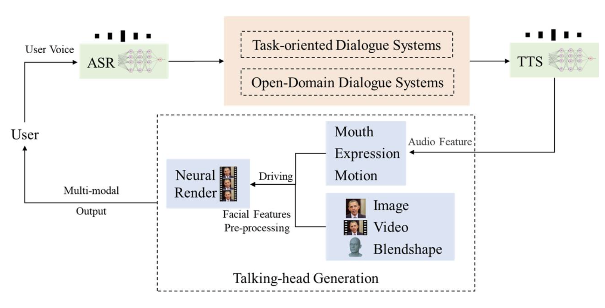

# 数字人智能对话系统 - Linly-Talker — “数字人交互，与虚拟的自己互动”

<div align="center">
<h1>Linly-Talker WebUI</h1>

[](https://github.com/Kedreamix/Linly-Talker)

<br>

[](https://colab.research.google.com/github/Kedreamix/Linly-Talker/blob/main/colab_webui.ipynb)
[](https://github.com/Kedreamix/Linly-Talker/blob/main/LICENSE)
[](https://huggingface.co/Kedreamix/Linly-Talker)

[**English**](./README.md) | [**中文简体**](./README_zh.md)

</div>

**2023.12 更新** 📆

**用户可以上传任意图片进行对话**

**2024.01 更新** 📆

- **令人兴奋的消息！我现在已经将强大的GeminiPro和Qwen大模型融入到我们的对话场景中。用户现在可以在对话中上传任何图片，为我们的互动增添了全新的层面。**
- **更新了FastAPI的部署调用方法。** 
- **更新了微软TTS的高级设置选项，增加声音种类的多样性，以及加入视频字幕加强可视化。**
- **更新了GPT多轮对话系统，使得对话有上下文联系，提高数字人的交互性和真实感。**

**2024.02 更新** 📆

- **更新了Gradio的版本为最新版本4.16.0，使得界面拥有更多的功能，比如可以摄像头拍摄图片构建数字人等。**
- **更新了ASR和THG，其中ASR加入了阿里的FunASR，具体更快的速度；THG部分加入了Wav2Lip模型，ER-NeRF在准备中(Comming Soon)。**
- **加入了语音克隆方法GPT-SoVITS模型，能够通过微调一分钟对应人的语料进行克隆，效果还是相当不错的，值得推荐。**
- **集成一个WebUI界面，能够更好的运行Linly-Talker。**

**2024.04 更新** 📆

- **更新了除 Edge TTS的 Paddle TTS的离线方式。**
- **更新了ER-NeRF作为Avatar生成的选择之一。**
- **更新了app_talk.py，在不基于对话场景可自由上传语音和图片视频生成。**

---

<details>
<summary>目录</summary>

<!-- TOC -->

- [数字人对话系统 - Linly-Talker —— “数字人交互，与虚拟的自己互动”](#数字人对话系统---linly-talker--数字人交互与虚拟的自己互动)
  - [介绍](#介绍)
  - [TO DO LIST](#to-do-list)
  - [示例](#示例)
  - [创建环境](#创建环境)
  - [ASR - Speech Recognition](#asr---speech-recognition)
    - [Whisper](#whisper)
    - [FunASR](#funasr)
  - [TTS - Edge TTS](#tts---edge-tts)
  - [Voice Clone](#voice-clone)
    - [GPT-SoVITS（推荐）](#gpt-sovits推荐)
    - [XTTS](#xtts)
  - [THG - Avatar](#thg---avatar)
    - [SadTalker](#sadtalker)
    - [Wav2Lip](#wav2lip)
    - [ER-NeRF（Comming Soon）](#er-nerfcomming-soon)
  - [LLM - Conversation](#llm---conversation)
    - [Linly-AI](#linly-ai)
    - [Qwen](#qwen)
    - [Gemini-Pro](#gemini-pro)
    - [LLM 多模型选择](#llm-多模型选择)
  - [优化](#优化)
  - [Gradio](#gradio)
  - [启动WebUI](#启动webui)
  - [文件夹结构](#文件夹结构)
  - [参考](#参考)
  - [Star History](#star-history)

<!-- /TOC -->

</details>

## 介绍

Linly-Talker是一款创新的数字人对话系统，它融合了最新的人工智能技术，包括大型语言模型（LLM）🤖、自动语音识别（ASR）🎙️、文本到语音转换（TTS）🗣️和语音克隆技术🎤。这个系统通过Gradio平台提供了一个交互式的Web界面，允许用户上传图片📷与AI进行个性化的对话交流💬。

系统的核心特点包括：
1. **多模型集成**：Linly-Talker整合了Linly、GeminiPro、Qwen等大模型，以及Whisper、SadTalker等视觉模型，实现了高质量的对话和视觉生成。
2. **多轮对话能力**：通过GPT模型的多轮对话系统，Linly-Talker能够理解并维持上下文相关的连贯对话，极大地提升了交互的真实感。
3. **语音克隆**：利用GPT-SoVITS等技术，用户可以上传一分钟的语音样本进行微调，系统将克隆用户的声音，使得数字人能够以用户的声音进行对话。
4. **实时互动**：系统支持实时语音识别和视频字幕，使得用户可以通过语音与数字人进行自然的交流。
5. **视觉增强**：通过数字人生成等技术，Linly-Talker能够生成逼真的数字人形象，提供更加沉浸式的体验。

Linly-Talker的设计理念是创造一种全新的人机交互方式，不仅仅是简单的问答，而是通过高度集成的技术，提供一个能够理解、响应并模拟人类交流的智能数字人。



> 查看我们的介绍视频 [demo video](https://www.bilibili.com/video/BV1rN4y1a76x/)
>
> 在B站上我录了一系列视频，也代表我更新的每一步与使用方法，详细查看[数字人智能对话系统 - Linly-Talker合集](https://space.bilibili.com/241286257/channel/collectiondetail?sid=2065753)
>
> -  [🔥🔥🔥数字人对话系统 Linly-Talker🔥🔥🔥](https://www.bilibili.com/video/BV1rN4y1a76x/)
> - [🚀数字人的未来：Linly-Talker+GPT-SoVIT语音克隆技术的赋能之道](https://www.bilibili.com/video/BV1S4421A7gh/)
> - [AutoDL平台部署Linly-Talker (0基础小白超详细教程)](https://www.bilibili.com/video/BV1uT421m74z/)
> - [Linly-Talker 更新离线TTS集成及定制数字人方案](https://www.bilibili.com/video/BV1Mr421u7NN/)

## TO DO LIST

- [x] 基本完成对话系统流程，能够`语音对话`
- [x] 加入了LLM大模型，包括`Linly`，`Qwen`和`GeminiPro`的使用
- [x] 可上传`任意数字人照片`进行对话
- [x] Linly加入`FastAPI`调用方式
- [x] 利用微软`TTS`加入高级选项，可设置对应人声以及音调等参数，增加声音的多样性
- [x] 视频生成加入`字幕`，能够更好的进行可视化
- [x] GPT`多轮对话`系统（提高数字人的交互性和真实感，增强数字人的智能）
- [x] 优化Gradio界面，加入更多模型，如Wav2Lip，FunASR等
- [x] `语音克隆`技术，加入GPT-SoVITS，只需要一分钟的语音简单微调即可（语音克隆合成自己声音，提高数字人分身的真实感和互动体验）
- [x] 加入离线TTS以及NeRF-based的方法和模型
- [ ] `实时`语音识别（人与数字人之间就可以通过语音进行对话交流)

🔆 该项目 Linly-Talker 正在进行中 - 欢迎提出PR请求！如果您有任何关于新的模型方法、研究、技术或发现运行错误的建议，请随时编辑并提交 PR。您也可以打开一个问题或通过电子邮件直接联系我。📩⭐ 如果您发现这个Github Project有用，请给它点个星！🤩

> 如果在部署的时候有任何的问题，可以关注[常见问题汇总.md](https://github.com/Kedreamix/Linly-Talker/blob/main/常见问题汇总.md)部分，我已经整理了可能出现的所有问题，另外交流群也在这里，我会定时更新，感谢大家的关注与使用！！！

## 示例

|                        文字/语音对话                         |                          数字人回答                          |
| :----------------------------------------------------------: | :----------------------------------------------------------: |
|                 应对压力最有效的方法是什么？                 | <video src="https://github.com/Kedreamix/Linly-Talker/assets/61195303/f1deb189-b682-4175-9dea-7eeb0fb392ca"></video> |
|                      如何进行时间管理？                      | <video src="https://github.com/Kedreamix/Linly-Talker/assets/61195303/968b5c43-4dce-484b-b6c6-0fd4d621ac03"></video> |
|  撰写一篇交响乐音乐会评论，讨论乐团的表演和观众的整体体验。  | <video src="https://github.com/Kedreamix/Linly-Talker/assets/61195303/f052820f-6511-4cf0-a383-daf8402630db"></video> |
| 翻译成中文：Luck is a dividend of sweat. The more you sweat, the luckier you get. | <video src="https://github.com/Kedreamix/Linly-Talker/assets/61195303/118eec13-a9f7-4c38-b4ad-044d36ba9776"></video> |

## 创建环境

首先使用anaconda安装环境，安装pytorch环境，具体操作如下：

```bash
conda create -n linly python=3.10  
conda activate linly

# pytorch安装方式1：conda安装（推荐）
conda install pytorch==1.12.1 torchvision==0.13.1 torchaudio==0.12.1 cudatoolkit=11.3 -c pytorch

# pytorch安装方式2：pip 安装
pip install torch==1.12.1+cu113 torchvision==0.13.1+cu113 torchaudio==0.12.1 --extra-index-url https://download.pytorch.org/whl/cu113

conda install -q ffmpeg # ffmpeg==4.2.2

pip install -r requirements_app.txt
```

若使用语音克隆等模型，需要更高版本的Pytorch，但是功能也会更加丰富，不过需要的驱动版本可能要到cuda11.8，可选择

```bash
conda create -n linly python=3.10  
conda activate linly

pip install torch==2.1.0 torchvision==0.16.0 torchaudio==2.1.0 --index-url https://download.pytorch.org/whl/cu118

conda install -q ffmpeg # ffmpeg==4.2.2

pip install -r requirements_app.txt

# 安装语音克隆对应的依赖
pip install -r VITS/requirements_gptsovits.txt
```

若希望使用NeRF-based等模型等话，可能需要安装一下对应的环境

```bash
# 安装NeRF对应的依赖
pip install "git+https://github.com/facebookresearch/pytorch3d.git"
pip install -r TFG/requirements_nerf.txt

# 若pyaudio出现问题，可安装对应依赖
# sudo apt-get install libasound-dev portaudio19-dev libportaudio2 libportaudiocpp0

# 注意以下几个模块，若安装不成功，可以进入路径利用pip install . 或者 python setup.py install编译安装
# NeRF/freqencoder
# NeRF/gridencoder
# NeRF/raymarching
# NeRF/shencoder
```

若使用PaddleTTS，可安装对应的环境

```bash
pip install -r TTS/requirements_paddle.txt
```

接下来还需要安装对应的模型，有以下下载方式，下载后安装文件架结构放置，文件夹结构在本文最后有说明。

- [Baidu (百度云盘)](https://pan.baidu.com/s/1eF13O-8wyw4B3MtesctQyg?pwd=linl) (Password: `linl`)
- [huggingface](https://huggingface.co/Kedreamix/Linly-Talker)
- [modelscope](https://www.modelscope.cn/models/Kedreamix/Linly-Talker/summary) 

**HuggingFace下载**

如果速度太慢可以考虑镜像，参考[简便快捷获取 Hugging Face 模型（使用镜像站点）](https://kedreamix.github.io/2024/01/05/Note/HuggingFace/?highlight=镜像)

```bash
# 从huggingface下载预训练模型
git lfs install
git clone https://huggingface.co/Kedreamix/Linly-Talker
```

**ModelScope下载**

```bash
# 从modelscope下载预训练模型
# 1. git 方法
git lfs install
git clone https://www.modelscope.cn/Kedreamix/Linly-Talker.git

# 2. Python 代码下载
pip install modelscope
from modelscope import snapshot_download
model_dir = snapshot_download('Kedreamix/Linly-Talker')
```

**移动所有模型到当前目录**

如果百度网盘下载后，可以参考文档最后目录结构来移动

```bash
# 移动所有模型到当前目录
# checkpoint中含有SadTalker和Wav2Lip
mv Linly-Talker/checkpoints/* ./checkpoints

# SadTalker的增强GFPGAN
# pip install gfpgan
# mv Linly-Talker/gfpan ./

# 语音克隆模型
mv Linly-Talker/GPT_SoVITS/pretrained_models/* ./GPT_SoVITS/pretrained_models/

# Qwen大模型
mv Linly-Talker/Qwen ./
```

为了大家的部署使用方便，更新了一个`configs.py`文件，可以对其进行一些超参数修改即可

```bash
# 设备运行端口 (Device running port)
port = 7860
# api运行端口及IP (API running port and IP)
mode = 'api' # api 需要先运行Linly-api-fast.py，暂时仅仅适用于Linly

# 本地端口localhost:127.0.0.1 全局端口转发:"0.0.0.0"
ip = '127.0.0.1' 
api_port = 7871

# L模型路径 (Linly model path)
mode = 'offline'
model_path = 'Qwen/Qwen-1_8B-Chat'

# ssl证书 (SSL certificate) 麦克风对话需要此参数
# 最好调整为绝对路径
ssl_certfile = "./https_cert/cert.pem"
ssl_keyfile = "./https_cert/key.pem"
```

## ASR - Speech Recognition

详细有关于语音识别的**使用介绍**与**代码实现**可见 [ASR - 同数字人沟通的桥梁](./ASR/README.md)

### Whisper

借鉴OpenAI的Whisper实现了ASR的语音识别，具体使用方法参考 [https://github.com/openai/whisper](https://github.com/openai/whisper)

### FunASR

阿里的`FunASR`的语音识别效果也是相当不错，而且时间也是比whisper更快的，对中文实际上是更好的。

同时funasr更能达到实时的效果，所以也将FunASR添加进去了，在ASR文件夹下的FunASR文件里可以进行体验，参考 [https://github.com/alibaba-damo-academy/FunASR](https://github.com/alibaba-damo-academy/FunASR)。


## TTS Text To Speech

详细有关于语音识别的**使用介绍**与**代码实现**可见 [TTS - 赋予数字人真实的语音交互能力](./TTS/README.md)

### Edge TTS

借鉴使用微软语音服务，具体使用方法参考[https://github.com/rany2/edge-tts](https://github.com/rany2/edge-tts)


### PaddleTTS

在实际使用过程中，可能会遇到需要离线操作的情况。由于Edge TTS需要在线环境才能生成语音，因此我们选择了同样开源的PaddleSpeech作为文本到语音（TTS）的替代方案。虽然可能在效果上会有所差异，但PaddleSpeech支持离线操作。更多信息可参考PaddleSpeech的GitHub页面：[https://github.com/PaddlePaddle/PaddleSpeech](https://github.com/PaddlePaddle/PaddleSpeech)。https://github.com/PaddlePaddle/PaddleSpeech)


## Voice Clone

详细有关于语音克隆的**使用介绍**与**代码实现**可见 [Voice Clone - 在对话时悄悄偷走你的声音](./VITS/README.md)

### GPT-SoVITS（推荐）

感谢大家的开源贡献，我借鉴了当前开源的语音克隆模型 `GPT-SoVITS`，我认为效果是相当不错的，项目地址可参考[https://github.com/RVC-Boss/GPT-SoVITS](https://github.com/RVC-Boss/GPT-SoVITS)


### XTTS

Coqui XTTS是一个领先的深度学习文本到语音任务（TTS语音生成模型）工具包，通过使用一段5秒钟以上的语音频剪辑就可以完成声音克隆*将语音克隆到不同的语言*。

🐸TTS 是一个用于高级文本转语音生成的库。

🚀 超过 1100 种语言的预训练模型。

🛠️ 用于以任何语言训练新模型和微调现有模型的工具。

📚 用于数据集分析和管理的实用程序。

- 在线体验XTTS [https://huggingface.co/spaces/coqui/xtts](https://huggingface.co/spaces/coqui/xtts)
- 官方Github库 https://github.com/coqui-ai/TTS


## THG - Avatar

详细有关于数字人生成的**使用介绍**与**代码实现**可见 [THG - 构建智能数字人](./TFG/README.md)

### SadTalker

数字人生成可使用SadTalker（CVPR 2023）,详情介绍见 [https://sadtalker.github.io](https://sadtalker.github.io)

在使用前先下载SadTalker模型:

```bash
bash scripts/sadtalker_download_models.sh  
```

[Baidu (百度云盘)](https://pan.baidu.com/s/1eF13O-8wyw4B3MtesctQyg?pwd=linl) (Password: `linl`)

> 如果百度网盘下载，记住是放在checkpoints文件夹下，百度网盘下载的默认命名为sadtalker，实际应该重命名为checkpoints

### Wav2Lip

数字人生成还可使用Wav2Lip（ACM 2020），详情介绍见 [https://github.com/Rudrabha/Wav2Lip](https://github.com/Rudrabha/Wav2Lip)

在使用前先下载Wav2Lip模型：

| Model                        | Description                                           | Link to the model                                            |
| ---------------------------- | ----------------------------------------------------- | ------------------------------------------------------------ |
| Wav2Lip                      | Highly accurate lip-sync                              | [Link](https://iiitaphyd-my.sharepoint.com/:u:/g/personal/radrabha_m_research_iiit_ac_in/Eb3LEzbfuKlJiR600lQWRxgBIY27JZg80f7V9jtMfbNDaQ?e=TBFBVW) |
| Wav2Lip + GAN                | Slightly inferior lip-sync, but better visual quality | [Link](https://iiitaphyd-my.sharepoint.com/:u:/g/personal/radrabha_m_research_iiit_ac_in/EdjI7bZlgApMqsVoEUUXpLsBxqXbn5z8VTmoxp55YNDcIA?e=n9ljGW) |
| Expert Discriminator         | Weights of the expert discriminator                   | [Link](https://iiitaphyd-my.sharepoint.com/:u:/g/personal/radrabha_m_research_iiit_ac_in/EQRvmiZg-HRAjvI6zqN9eTEBP74KefynCwPWVmF57l-AYA?e=ZRPHKP) |
| Visual Quality Discriminator | Weights of the visual disc trained in a GAN setup     | [Link](https://iiitaphyd-my.sharepoint.com/:u:/g/personal/radrabha_m_research_iiit_ac_in/EQVqH88dTm1HjlK11eNba5gBbn15WMS0B0EZbDBttqrqkg?e=ic0ljo) |


### ER-NeRF

ER-NeRF（ICCV2023）是使用最新的NeRF技术构建的数字人，拥有定制数字人的特性，只需要一个人的五分钟左右到视频即可重建出来，具体可参考 [https://github.com/Fictionarry/ER-NeRF](https://github.com/Fictionarry/ER-NeRF)

已在app_talk.py部分更新，若考虑更好的效果，可能考虑克隆定制数字人的声音以得到更好的效果。


## LLM - Conversation

详细有关于大模型的**使用介绍**与**代码实现**可见 [LLM - 大语言模型为数字人赋能](./LLM/README.md)

### Linly-AI

Linly来自深圳大学数据工程国家重点实验室，参考 [https://github.com/CVI-SZU/Linly](https://github.com/CVI-SZU/Linly)


### Qwen

来自阿里云的Qwen，查看 [https://github.com/QwenLM/Qwen](https://github.com/QwenLM/Qwen)

如果想要快速使用，可以选1.8B的模型，参数比较少，在较小的显存也可以正常使用，当然这一部分可以替换

下载 Qwen1.8B 模型: [https://huggingface.co/Qwen/Qwen-1_8B-Chat](https://huggingface.co/Qwen/Qwen-1_8B-Chat)


### Gemini-Pro

来自 Google 的 Gemini-Pro，了解更多请访问 [https://deepmind.google/technologies/gemini/](https://deepmind.google/technologies/gemini/)

请求 API 密钥: [https://makersuite.google.com/](https://makersuite.google.com/)


### LLM 多模型选择

在 app.py 文件中，轻松选择您需要的模型。

```python
# 可以注释掉选择模型
# llm = LLM(mode='offline').init_model('Linly', 'Linly-AI/Chinese-LLaMA-2-7B-hf')
# llm = LLM(mode='offline').init_model('Gemini', 'gemini-pro', api_key = "your api key")
# llm = LLM(mode='offline').init_model('Qwen', 'Qwen/Qwen-1_8B-Chat')

# 可以通过config来设置模型
llm = LLM(mode=mode).init_model('Qwen', model_path)
```


## 优化

一些优化:

- 使用固定的输入人脸图像,提前提取特征,避免每次读取
- 移除不必要的库,缩短总时间
- 只保存最终视频输出,不保存中间结果,提高性能
- 使用OpenCV生成最终视频,比mimwrite更快

## Gradio

Gradio是一个Python库,提供了一种简单的方式将机器学习模型作为交互式Web应用程序来部署。

对Linly-Talker而言,使用Gradio有两个主要目的:

1. **可视化与演示**:Gradio为模型提供一个简单的Web GUI,上传图片和文本后可以直观地看到结果。这是展示系统能力的有效方式。

2. **用户交互**:Gradio的GUI可以作为前端,允许用户与Linly-Talker进行交互对话。用户可以上传自己的图片并输入问题,实时获取回答。这提供了更自然的语音交互方式。

具体来说,我们在app.py中创建了一个Gradio的Interface,接收图片和文本输入,调用函数生成回应视频,在GUI中显示出来。这样就实现了浏览器交互而不需要编写复杂的前端。

总之,Gradio为Linly-Talker提供了可视化和用户交互的接口,是展示系统功能和让最终用户使用系统的有效途径。

## 启动WebUI

之前我将很多个版本都是分开来的，实际上运行多个会比较麻烦，所以后续我增加了变成WebUI一个界面即可体验，后续也会不断更新

现在已加入WebUI的功能如下

- [x] 文本/语音数字人对话（固定数字人，分男女角色）
- [x] 任意图片数字人对话（可上传任意数字人）
- [x] 多轮GPT对话（加入历史对话数据，链接上下文）
- [x] 语音克隆对话（基于GPT-SoVITS设置进行语音克隆，内置烟嗓音，可根据语音对话的声音进行克隆）

```bash
# WebUI
python webui.py
```


现在的启动一共有几种模式，可以选择特定的场景进行设置

第一种只有固定了人物问答，设置好了人物，省去了预处理时间

```bash
python app.py
```


最近更新了第一种模式，加入了Wav2Lip模型进行对话

```bash
python appv2.py
```

第二种是可以任意上传图片进行对话

```bash
python app_img.py
```


第三种是在第一种的基础上加入了大语言模型，加入了多轮的GPT对话

```bash
python app_multi.py
```


现在加入了语音克隆的部分，可以自由切换自己克隆的声音模型和对应的人图片进行实现，这里我选择了一个烟嗓音和男生图片

```bash
python app_vits.py
```

加入了第四种方式，不固定场景进行对话，直接输入语音或者生成语音进行数字人生成，内置了Sadtalker，Wav2Lip，ER-NeRF等方式

> ER-NeRF是针对单独一个人的视频进行训练的，所以需要替换特定的模型才能进行渲染得到正确的结果，内置了Obama的权重，可直接用

```bash
python app_talk.py
```


## 文件夹结构

所有的权重部分可以从这下载

- [Baidu (百度云盘)](https://pan.baidu.com/s/1eF13O-8wyw4B3MtesctQyg?pwd=linl) (Password: `linl`)
- [huggingface](https://huggingface.co/Kedreamix/Linly-Talker)
- [modelscope](https://www.modelscope.cn/models/Kedreamix/Linly-Talker/files) comming soon

权重文件夹结构如下

```bash
Linly-Talker/ 
├── checkpoints
│   ├── hub
│   │   └── checkpoints
│   │       └── s3fd-619a316812.pth
│   ├── lipsync_expert.pth
│   ├── mapping_00109-model.pth.tar
│   ├── mapping_00229-model.pth.tar
│   ├── SadTalker_V0.0.2_256.safetensors
│   ├── visual_quality_disc.pth
│   ├── wav2lip_gan.pth
│   └── wav2lip.pth
├── gfpgan
│   └── weights
│       ├── alignment_WFLW_4HG.pth
│       └── detection_Resnet50_Final.pth
├── GPT_SoVITS
│   └── pretrained_models
│       ├── chinese-hubert-base
│       │   ├── config.json
│       │   ├── preprocessor_config.json
│       │   └── pytorch_model.bin
│       ├── chinese-roberta-wwm-ext-large
│       │   ├── config.json
│       │   ├── pytorch_model.bin
│       │   └── tokenizer.json
│       ├── README.md
│       ├── s1bert25hz-2kh-longer-epoch=68e-step=50232.ckpt
│       ├── s2D488k.pth
│       ├── s2G488k.pth
│       └── speech_paraformer-large_asr_nat-zh-cn-16k-common-vocab8404-pytorch
├── Qwen
│   └── Qwen-1_8B-Chat
│       ├── assets
│       │   ├── logo.jpg
│       │   ├── qwen_tokenizer.png
│       │   ├── react_showcase_001.png
│       │   ├── react_showcase_002.png
│       │   └── wechat.png
│       ├── cache_autogptq_cuda_256.cpp
│       ├── cache_autogptq_cuda_kernel_256.cu
│       ├── config.json
│       ├── configuration_qwen.py
│       ├── cpp_kernels.py
│       ├── examples
│       │   └── react_prompt.md
│       ├── generation_config.json
│       ├── LICENSE
│       ├── model-00001-of-00002.safetensors
│       ├── model-00002-of-00002.safetensors
│       ├── modeling_qwen.py
│       ├── model.safetensors.index.json
│       ├── NOTICE
│       ├── qwen_generation_utils.py
│       ├── qwen.tiktoken
│       ├── README.md
│       ├── tokenization_qwen.py
│       └── tokenizer_config.json
└── README.md
```


## 参考

**ASR**

- [https://github.com/openai/whisper](https://github.com/openai/whisper)
- [https://github.com/alibaba-damo-academy/FunASR](https://github.com/alibaba-damo-academy/FunASR)

**TTS**

- [https://github.com/rany2/edge-tts](https://github.com/rany2/edge-tts)  

**LLM**

- [https://github.com/CVI-SZU/Linly](https://github.com/CVI-SZU/Linly)
- [https://github.com/QwenLM/Qwen](https://github.com/QwenLM/Qwen)
- [https://deepmind.google/technologies/gemini/](https://deepmind.google/technologies/gemini/)

**THG**

- [https://github.com/OpenTalker/SadTalker](https://github.com/OpenTalker/SadTalker)
- [https://github.com/Rudrabha/Wav2Lip](https://github.com/Rudrabha/Wav2Lip)

**Voice Clone**

- [https://github.com/RVC-Boss/GPT-SoVITS](https://github.com/RVC-Boss/GPT-SoVITS)
- [https://github.com/coqui-ai/TTS](https://github.com/coqui-ai/TTS)

## Star History

[](https://star-history.com/#Kedreamix/Linly-Talker&Date)

