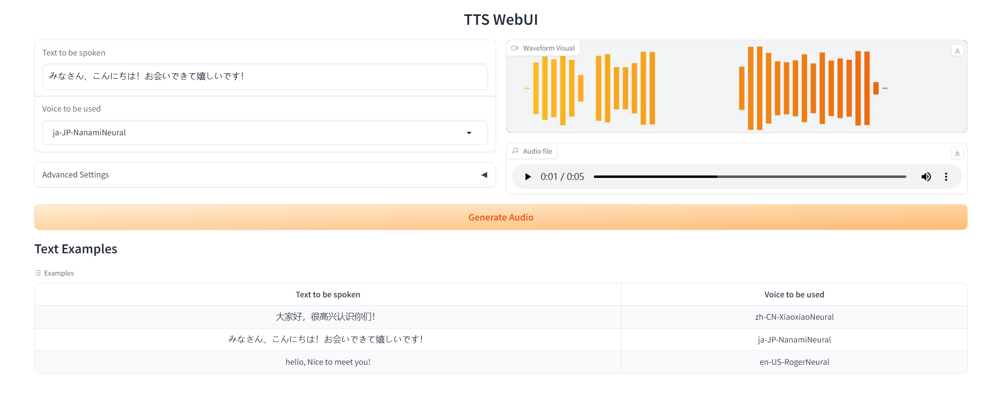

# TTS 赋予数字人真实的语音交互能力

## Edge-TTS

Edge-TTS是一个Python库，它使用微软的Azure Cognitive Services来实现文本到语音转换（TTS）。

该库提供了一个简单的API，可以将文本转换为语音，并且支持多种语言和声音。要使用Edge-TTS库，首先需要安装上Edge-TTS库，安装直接使用pip 进行安装即可。

```bash
pip install -U edge-tts
```

> 如果想更细究使用方式，可参考[https://github.com/rany2/edge-tts](https://github.com/rany2/edge-tts)


根据源代码，我编写了一个 `EdgeTTS` 的类，能够更好的使用，并且增加了保存字幕文件的功能，能增加体验感

```python
class EdgeTTS:
    def __init__(self, list_voices = False, proxy = None) -> None:
        voices = list_voices_fn(proxy=proxy)
        self.SUPPORTED_VOICE = [item['ShortName'] for item in voices]
        self.SUPPORTED_VOICE.sort(reverse=True)
        if list_voices:
            print(", ".join(self.SUPPORTED_VOICE))

    def preprocess(self, rate, volume, pitch):
        if rate >= 0:
            rate = f'+{rate}%'
        else:
            rate = f'{rate}%'
        if pitch >= 0:
            pitch = f'+{pitch}Hz'
        else:
            pitch = f'{pitch}Hz'
        volume = 100 - volume
        volume = f'-{volume}%'
        return rate, volume, pitch

    def predict(self,TEXT, VOICE, RATE, VOLUME, PITCH, OUTPUT_FILE='result.wav', OUTPUT_SUBS='result.vtt', words_in_cue = 8):
        async def amain() -> None:
            """Main function"""
            rate, volume, pitch = self.preprocess(rate = RATE, volume = VOLUME, pitch = PITCH)
            communicate = Communicate(TEXT, VOICE, rate = rate, volume = volume, pitch = pitch)
            subs: SubMaker = SubMaker()
            sub_file: Union[TextIOWrapper, TextIO] = (
                open(OUTPUT_SUBS, "w", encoding="utf-8")
            )
            async for chunk in communicate.stream():
                if chunk["type"] == "audio":
                    # audio_file.write(chunk["data"])
                    pass
                elif chunk["type"] == "WordBoundary":
                    # print((chunk["offset"], chunk["duration"]), chunk["text"])
                    subs.create_sub((chunk["offset"], chunk["duration"]), chunk["text"])
            sub_file.write(subs.generate_subs(words_in_cue))
            await communicate.save(OUTPUT_FILE)
            
        
        # loop = asyncio.get_event_loop_policy().get_event_loop()
        # try:
        #     loop.run_until_complete(amain())
        # finally:
        #     loop.close()
        asyncio.run(amain())
        with open(OUTPUT_SUBS, 'r', encoding='utf-8') as file:
            vtt_lines = file.readlines()

        # 去掉每一行文字中的空格
        vtt_lines_without_spaces = [line.replace(" ", "") if "-->" not in line else line for line in vtt_lines]
        # print(vtt_lines_without_spaces)
        with open(OUTPUT_SUBS, 'w', encoding='utf-8') as output_file:
            output_file.writelines(vtt_lines_without_spaces)
        return OUTPUT_FILE, OUTPUT_SUBS
```


同时在`src`文件夹下，写了一个简易的`WebUI`

```bash
python app.py
```



## PaddleTTS

在实际使用过程中，可能会遇到需要离线操作的情况。由于Edge TTS需要在线环境才能生成语音，因此我们选择了同样开源的PaddleSpeech作为文本到语音（TTS）的替代方案。虽然效果可能有所不同，但PaddleSpeech支持离线操作。更多信息可参考PaddleSpeech的GitHub页面：[PaddleSpeech](https://github.com/PaddlePaddle/PaddleSpeech)。

### 声码器说明

PaddleSpeech预置了三种声码器：【PWGan】【WaveRnn】【HifiGan】。这三种声码器在音质和生成速度上有较大差异，用户可根据需求进行选择。我们建议仅使用前两种声码器，因为WaveRNN的生成速度非常慢。

| 声码器  | 音频质量 |      生成速度      |
| :-----: | :------: | :----------------: |
|  PWGan  |   中等   |        中等        |
| WaveRnn |    高    | 非常慢（耐心等待） |
| HifiGan |    低    |         快         |

### TTS数据集

PaddleSpeech中的样例主要按数据集分类，我们主要使用的TTS数据集有：

- CSMCS（普通话单发音人）
- AISHELL3（普通话多发音人）
- LJSpeech（英文单发音人）
- VCTK（英文多发音人）

### PaddleSpeech的TTS模型映射

PaddleSpeech的TTS模型与以下模型相对应：

- tts0 - Tacotron2
- tts1 - TransformerTTS
- tts2 - SpeedySpeech
- tts3 - FastSpeech2
- voc0 - WaveFlow
- voc1 - Parallel WaveGAN
- voc2 - MelGAN
- voc3 - MultiBand MelGAN
- voc4 - Style MelGAN
- voc5 - HiFiGAN
- vc0 - Tacotron2 Voice Clone with GE2E
- vc1 - FastSpeech2 Voice Clone with GE2E

### 预训练模型列表

以下是PaddleSpeech提供的可通过命令行和Python API使用的预训练模型列表：

#### 声学模型

| 模型                         |  语言  |
| :--------------------------- | :----: |
| speedyspeech_csmsc           |   zh   |
| fastspeech2_csmsc            |   zh   |
| fastspeech2_ljspeech         |   en   |
| fastspeech2_aishell3         |   zh   |
| fastspeech2_vctk             |   en   |
| fastspeech2_cnndecoder_csmsc |   zh   |
| fastspeech2_mix              |  mix   |
| tacotron2_csmsc              |   zh   |
| tacotron2_ljspeech           |   en   |
| fastspeech2_male             |   zh   |
| fastspeech2_male             |   en   |
| fastspeech2_male             |  mix   |
| fastspeech2_canton           | canton |

#### 声码器

| 模型               | 语言 |
| :----------------- | :--: |
| pwgan_csmsc        |  zh  |
| pwgan_ljspeech     |  en  |
| pwgan_aishell3     |  zh  |
| pwgan_vctk         |  en  |
| mb_melgan_csmsc    |  zh  |
| style_melgan_csmsc |  zh  |
| hifigan_csmsc      |  zh  |
| hifigan_ljspeech   |  en  |
| hifigan_aishell3   |  zh  |
| hifigan_vctk       |  en  |
| wavernn_csmsc      |  zh  |
| pwgan_male         |  zh  |
| hifigan_male       |  zh  |

根据PaddleSpeech，我编写了一个 `PaddleTTS` 的类，能够更好的使用和运行结果

```python
class PaddleTTS:
    def __init__(self) -> None:
        pass
        
    def predict(self, text, am, voc, spk_id = 174, lang = 'zh', male=False, save_path = 'output.wav'):
        self.tts = TTSExecutor()
        
        use_onnx = True
        voc = voc.lower()
        am = am.lower()
        
        if male:
            assert voc in ["pwgan", "hifigan"], "male voc must be 'pwgan' or 'hifigan'"
            wav_file = self.tts(
            text = text,
            output = save_path,
            am='fastspeech2_male',
            voc= voc + '_male',
            lang=lang,
            use_onnx=use_onnx
            )
            return wav_file
    
        assert am in ['tacotron2', 'fastspeech2'], "am must be 'tacotron2' or 'fastspeech2'"
        
        # 混合中文英文语音合成
        if lang == 'mix':
            # mix只有fastspeech2
            am = 'fastspeech2_mix'
            voc += '_csmsc'
        # 英文语音合成
        elif lang == 'en':
            am += '_ljspeech'
            voc += '_ljspeech'
        # 中文语音合成
        elif lang == 'zh':
            assert voc in ['wavernn', 'pwgan', 'hifigan', 'style_melgan', 'mb_melgan'], "voc must be 'wavernn' or 'pwgan' or 'hifigan' or 'style_melgan' or 'mb_melgan'"
            am += '_csmsc'
            voc += '_csmsc'
        elif lang == 'canton':
            am = 'fastspeech2_canton'
            voc = 'pwgan_aishell3'
            spk_id = 10
        print("am:", am, "voc:", voc, "lang:", lang, "male:", male, "spk_id:", spk_id)
        try:
            cmd = f'paddlespeech tts --am {am} --voc {voc} --input "{text}" --output {save_path} --lang {lang} --spk_id {spk_id} --use_onnx {use_onnx}'
            os.system(cmd)
            wav_file = save_path
        except:
            # 语音合成
            wav_file = self.tts(
                text = text,
                output = save_path,
                am = am,
                voc = voc,
                lang = lang,
                spk_id = spk_id,
                use_onnx=use_onnx
                )
        return wav_file 
```

