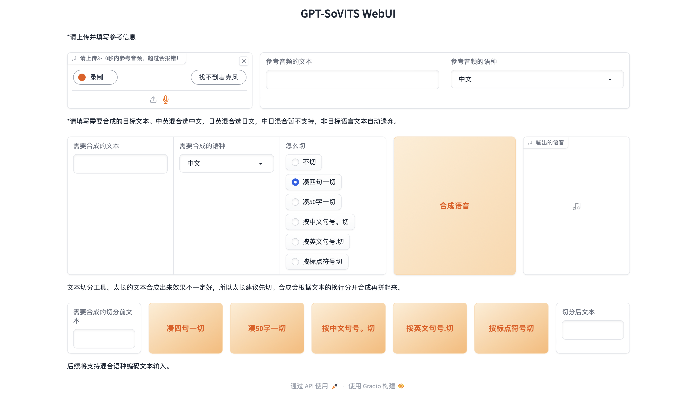
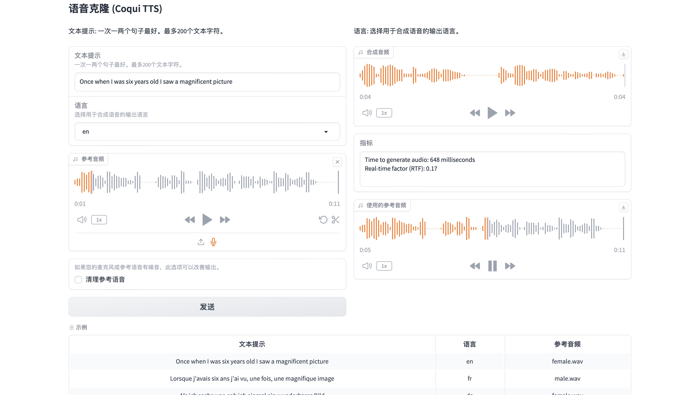

## Voice Clone 在对话时悄悄偷走你的声音

### GPT-SoVITS（推荐）

感谢大家的开源贡献，我借鉴了当前开源的语音克隆模型 `GPT-SoVITS`，我认为效果是相当不错的，项目地址可参考[https://github.com/RVC-Boss/GPT-SoVITS](https://github.com/RVC-Boss/GPT-SoVITS)

他有以下功能：

1. **零样本文本到语音（TTS）：** 输入 5 秒的声音样本，即刻体验文本到语音转换。
2. **少样本 TTS：** 仅需 1 分钟的训练数据即可微调模型，提升声音相似度和真实感。
3. **跨语言支持：** 支持与训练数据集不同语言的推理，目前支持英语、日语和中文。
4. **WebUI 工具：** 集成工具包括声音伴奏分离、自动训练集分割、中文自动语音识别(ASR)和文本标注，协助初学者创建训练数据集和 GPT/SoVITS 模型。

之前很多方法都是少样本，比如`OpenVoice`和`XTTS`，我之前也想着使用他们来进行实现语音克隆部分，但是很遗憾的是，并没有感觉有很好的效果，其实`XTTS`还是不错的，如果我们简单用麦克风🎤说几句话作为参考来进行克隆，我觉得效果还是可以的。

但是如果遇到比较高的要求，我觉得可能就需要更好的模型，并且成本也要打压下来，所以我就看到了这个`GPT-SoVITS`，我觉得这个模型是相当厉害的，少样本的TTS能做，也能做跨语言支持，这样我们很有可能就可以体验到奥巴马讲中文之类的，这样就可以完成视频翻译的一些任务了，所以我是很推崇这样的简单微调，效果又好的方法的。

**为了尊重作者，我并没有把`GPT-SoVITS`的全套代码搬过来，我写了一个关于语音克隆的类，大家可以将训练好的模型参数中，就可以在本项目使用经过语音克隆后的TTS了，希望大家玩的开心，玩的愉快。**


> 如果使用语音克隆模型，可能需要python为3.10，pytorch为2.1左右可能比较好，我的环境已经测试过了，简单来说，先安装GPT-SoVITS的环境，再直接pip intsall -r requirements_app.txt即可使用
>
> 除此之外，还需要根据原作者的说明放入对应路径，我的预训练模型和存放位置已给出，可参考[https://huggingface.co/Kedreamix/Linly-Talker](https://huggingface.co/Kedreamix/Linly-Talker)

```python
pip install torch==2.1.0 torchvision==0.16.0 torchaudio==2.1.0 --index-url https://download.pytorch.org/whl/cu118
# 安装对应的依赖
pip install -r VITS/requirements_gptsovits.txt

# 启动如下的WebUI界面
python VITS/app.py 
```



### Coqui XTTS

Coqui XTTS是一个领先的深度学习文本到语音任务（TTS语音生成模型）工具包，通过使用一段5秒钟以上的语音频剪辑就可以完成声音克隆*将语音克隆到不同的语言*。支持多种语言文本到语音转换，使其成为国际化应用的理想选择，这一特点特别适用于全球化的市场，其中需要生成多种语言的语音内容。所以在实验过程中，我也加入了这一部分，不过暂时使用的是默认的模型，并没有进行微调，个人认为是没有GPT-SoVITS经过微调后好的，但是其中的少样本五秒钟克隆语音还是值得称赞的。大家也可以在官方的在线体验，但是官方的可能会有生成语音限制，文字不能太长，但是还是足够我们体验了。

🐸TTS 是一个用于高级文本转语音生成的库。

🚀 超过 1100 种语言的预训练模型。

🛠️ 用于以任何语言训练新模型和微调现有模型的工具。

📚 用于数据集分析和管理的实用程序。

- 在线体验XTTS [https://huggingface.co/spaces/coqui/xtts](https://huggingface.co/spaces/coqui/xtts)
- 官方Github库 https://github.com/coqui-ai/TTS

XTTS的环境也需要PyTorch 2.1所以，如果下载了GPT-SoVITS，也不妨体验一下XTTS的效果。

```bash
pip install torch==2.1.0 torchvision==0.16.0 torchaudio==2.1.0 --index-url https://download.pytorch.org/whl/cu118

# 安装对应的依赖
pip install -r VITS/requirements_xtts.txt

# 启动如下的WebUI界面
python VITS/XTTS.py
```




